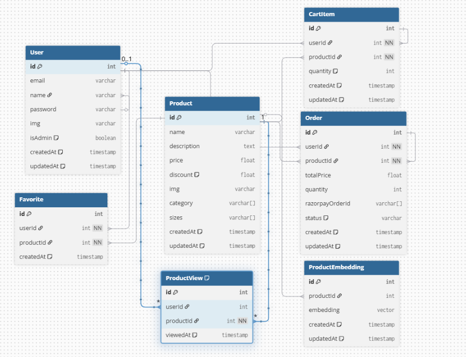

# eShop - AI-Powered E-Commerce Platform

A production-ready full-stack e-commerce application featuring advanced AI-powered product recommendations, semantic search capabilities, and intelligent browsing history. Built as an academic project showcasing modern web development practices and cutting-edge AI integration.
This project demonstrates end-to-end application design, containerized deployments, CI/CD automation, and scalable cloud infrastructure using AWS.

[](https://e-shop-virid.vercel.app/)
[](http://13.49.244.25/)
[](LICENSE)

> ⚠️ **Educational Project Notice**
>
> This project was built **strictly for educational and academic purposes**.  
> The live aws deployment may be **modified or taken down in the future** to manage infrastructure costs.


## 🌟 Key Features

### Core E-Commerce Functionality
- **Product Catalog** - Comprehensive product inventory with category-based browsing
- **Smart Shopping Cart** - Real-time cart management with quantity updates and price calculations
- **Secure Authentication** - JWT-based user authentication with protected routes
- **Order Management** - Complete order processing, tracking, and history
- **Favorites System** - Save and manage favorite products for later

### AI-Powered Features 🤖

#### 1. **Semantic Search**
Two search modes for maximum flexibility:
- **Traditional Search** - Fast keyword-based product search
- **AI Semantic Search** - Natural language product discovery
  - Users can describe what they're looking for in plain English
  - Example: "comfortable running shoes for marathon training"
  - AI understands intent and finds semantically similar products
  - Powered by Gemini-004 embeddings and vector similarity

#### 2. **"You Might Like" Recommendations**
- Personalized product suggestions on the homepage
- Analyzes user browsing patterns and preferences
- Uses vector similarity to match user interests
- Updates dynamically based on user behavior

#### 3. **Similar Products Discovery**
- Every product page displays AI-recommended similar items
- Cosine similarity search finds semantically related products
- Goes beyond simple category matching
- Discovers products with similar attributes, style, and purpose

#### 4. **Recently Viewed History**
- Intelligent browsing history that persists across sessions
- Automatically tracks products users view
- Helps users pick up where they left off
- Database-backed for reliability

### Design & UX
- **Minimalist Interface** - Clean, modern design inspired by premium e-commerce sites
- **Fully Responsive** - Seamless experience across mobile, tablet, and desktop
- **Fast Performance** - Optimized loading and smooth interactions

## 🛠️ Technology Stack

### Frontend
- **React 19** - Modern UI with hooks and concurrent features
- **TypeScript** - Type-safe development
- **Redux Toolkit** - Predictable state management
- **RTK Query** - Powerful data fetching and caching
- **Tailwind CSS** - Utility-first styling
- **Shadcn UI** - Accessible component library
- **React Router v6** - Client-side routing
- **Vite** - Lightning-fast build tool

### Backend
- **Node.js** - JavaScript runtime
- **Express.js** - Robust web framework
- **TypeScript** - Type-safe backend development
- **PostgreSQL** - Reliable relational database
- **Prisma ORM** - Type-safe database client
- **pgvector Extension** - Vector similarity search
- **JWT** - Secure token-based authentication
- **Bcrypt** - Password hashing

### AI & Machine Learning
- **Gemini-004 API** - State-of-the-art embeddings generation
- **Vector Embeddings** - 512-dimensional product representations
- **Cosine Similarity** - Semantic matching algorithm
- **pgvector** - High-performance vector operations in PostgreSQL

## ☁️ Deployment & Infrastructure

This application is also **fully containerized and deployed on AWS** using modern DevOps practices.

### Deployment Stack
- **AWS EC2** – Hosting the production server
- **Docker** – Containerization of frontend and backend services
- **Docker Compose** – Multi-container orchestration
- **Nginx** – Reverse proxy and static file serving

### Deployment Architecture
- Frontend (React) served via **Nginx**
- Backend (Node.js + Express) running in a separate container
- PostgreSQL hosted on **Neon (managed PostgreSQL)**
- All services orchestrated using **docker-compose**

> The application follows a production-grade setup similar to real-world SaaS deployments.


## 🏗️ Project Architecture

### Frontend Structure
```
client/
├── src/
│   ├── components/          # Reusable UI components
│   │   ├── Hero.tsx
│   │   ├── ProductCard.tsx
│   │   ├── NavBar.tsx
│   │   ├── RecentlyViewed.tsx
│   │   ├── UserRecommendation.tsx
│   │   └── ui/              # Shadcn UI components
│   ├── pages/               # Route-based pages
│   │   ├── Home.tsx
│   │   ├── Product.tsx
│   │   ├── Cart.tsx
│   │   ├── Orders.tsx
│   │   └── ...
│   ├── store/               # Redux store
│   │   ├── index.ts         # Store configuration
│   │   └── authSlice.ts     # Auth state slice
│   ├── services/            # RTK Query APIs
│   │   ├── user.services.ts
│   │   ├── product.services.ts
│   │   ├── cart.services.ts
│   │   └── favourites.services.ts
│   ├── types/               # TypeScript definitions
│   ├── layout/              # Layout components
│   └── lib/                 # Utilities
└── ...
```

### Backend Structure
```
server/
├── src/
│   ├── controllers/         # Request handlers
│   │   ├── user.controller.ts
│   │   ├── product.controller.ts
│   │   ├── cart.controller.ts
│   │   ├── recommendation.controller.ts
│   │   └── ...
│   ├── routes/              # API routes
│   │   ├── user.routes.ts
│   │   ├── product.routes.ts
│   │   └── ...
│   ├── middlewares/         # Custom middleware
│   │   ├── authMiddleware.ts
│   │   ├── Validation.ts
│   │   └── multerMiddleware.ts
│   ├── utils/               # Helper functions
│   │   ├── embeddings.ts    # AI embedding generation
│   │   └── utils.ts
│   ├── config/              # Configuration
│   │   └── db.ts            # Database connection
│   └── types/               # TypeScript definitions
├── prisma/
│   ├── schema.prisma        # Database schema
│   ├── migrations/          # Database migrations
│   └── seed/                # Seed data
└── ...
```

### Database Schema



**Live diagram:**  
👉 https://dbdiagram.io/d/692c25f8d6676488baf1aa00

### Use Cases

| Feature | Description | Implementation |
|---------|-------------|----------------|
| **Product Page Recommendations** | "Similar Products" section | Finds products with similar embeddings to current product |
| **Homepage Recommendations** | "You Might Like" section | Analyzes recently viewed products, finds similar items |
| **Semantic Search** | Natural language search | Converts query to embedding, finds matching products |


## 🚀 Getting Started

### Prerequisites
- **Node.js** v18 or higher
- **PostgreSQL** v14 or higher with pgvector extension
- **pnpm** (recommended) or npm
- **Gemini API Key** from Google AI Studio

### Installation

1. **Clone the repository**
```bash
git clone https://github.com/Himanshu0518/eShop.git
cd eShop
```

2. **Install dependencies**

Frontend:
```bash
cd client
pnpm install
```

Backend:
```bash
cd server
pnpm install
```

3. **Set up PostgreSQL**

Create database:
```sql
CREATE DATABASE eshop;
\c eshop
CREATE EXTENSION vector;
```

4. **Configure environment variables**

Server `.env`:
```env
# Server Configuration
DATABASE_URL=your_db_uri

PORT=8000

JWT_SECRET=your_jwt_secret_key

CLIENT_URL=http://localhost:5173

CLOUDINARY_CLOUD_NAME=...
CLOUDINARY_API_KEY=...
CLOUDINARY_API_SECRET=...
GEMINI_API_KEY=...
```

Client `.env`:
```env
VITE_API_URL=http://localhost:8000
```

5. **Run database migrations**
```bash
cd server
pnpm prisma migrate dev
```

6. **Seed the database** (optional but recommended)
```bash
pnpm run seed
```

This will:
- Create sample users
- Add 50+ products with embeddings
- Generate test orders
- Populate categories

### **7. When making any change to embeddings or database schema**

If you modify the database schema directly in **Neon** (for example: changing embeddings, adding a column, or updating relations), follow these steps to keep Prisma in sync **without resetting data**.

---

#### **7.1 — Apply the change in Neon**
Run the required SQL command in the **Neon SQL Console** to update the database schema.

---

#### **7.2 — Create an empty migration locally**
Create a new migration folder:

```bash
mkdir prisma/migrations/20251201_add_product_to_order
Inside the folder, create a migration.sql file:

touch prisma/migrations/20251201_add_product_to_order/migration.sql


Add a comment to indicate the change was applied manually:

-- Schema updated manually in Neon

7.3 — Mark the migration as applied

Tell Prisma that this migration has already been applied to the database:

npx prisma migrate resolve --applied 20251201_add_product_to_order


This updates Prisma’s migration history without modifying the database.

7.4 — Verify migration status

Always verify that Prisma is in sync with the database:

npx prisma migrate status

```

### Running the Application

**Development Mode:**

Terminal 1 (Frontend):
```bash
cd client
pnpm dev
```

Terminal 2 (Backend):
```bash
cd server
pnpm dev
```

Access:
- Frontend: `http://localhost:5173`
- Backend API: `http://localhost:8000`

**Production Build:**
```bash
# Build frontend
cd client
pnpm build

# Start backend
cd server
pnpm start
```


## 👥 Contributing

This is primarily an academic project, but contributions are welcome!

### How to Contribute
1. Fork the repository
2. Create a feature branch (`git checkout -b feature/AmazingFeature`)
3. Commit your changes (`git commit -m 'Add some AmazingFeature'`)
4. Push to the branch (`git push origin feature/AmazingFeature`)
5. Open a Pull Request

### Contribution Guidelines
- Follow existing code style
- Add tests for new features
- Update documentation
- Keep commits atomic and well-described


## 👨‍💻 About the Developer

**Himanshu Singh**  
B.Tech 3rd Year | Electronics and Communication Engineering | IIIT Una

Passionate about full-stack development, AI/ML integration, and building scalable web applications. This project represents a culmination of months of learning and hands-on development.

### Connect
- **GitHub**: [@Himanshu0518](https://github.com/Himanshu0518)
- **LinkedIn**: [Himanshu Singh](https://www.linkedin.com/in/himanshu-singh23226)
- **Email**: himanshu.iiitu2027@gmail.com
- **Portfolio**: [MyPortfolio](https://my-portfolio-two-red-70.vercel.app)

## 🙏 Acknowledgments

Special thanks to:
- **Google AI** - For the Gemini API and advanced AI capabilities
- **Vercel** - For excellent deployment platform and documentation
- **Shadcn** - For the beautiful, accessible component library
- **Tailwind Labs** - For the powerful utility-first CSS framework
- **PostgreSQL Community** - For the pgvector extension
- **Prisma Team** - For the excellent ORM and developer experience

## 📌 Important Note

This project is maintained as a **learning and portfolio project**.  
The live deployment and cloud resources may be **paused or removed at any time** to reduce ongoing costs.

If the live demo is unavailable, the complete source code and setup instructions remain fully accessible in this repository.

## 📞 Support & Feedback


### Show Your Support
If you found this project helpful or interesting:
- ⭐ Star the repository
- 🍴 Fork and build upon it
- 📢 Share with others
- 🐛 Report issues
- 💡 Suggest new features

---

<div align="center">

**Built with ❤️ as an academic project**

Demonstrating modern full-stack development with AI integration

[Report Bug](https://github.com/Himanshu0518/eShop/issues) · [Request Feature](https://github.com/Himanshu0518/eShop/issues) · 

</div>